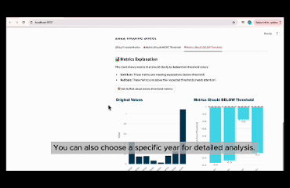

# Financial-Chatbot

> A financial chatbot fine-tuned on T5, enhanced with RAG and OpenAI API to analyze and interpret financial statements through Buffett-style reasoning.

---

## 📌 Key Features

1. **Financial Statement Visualization**:  
   Select and visualize key metrics (e.g. Gross Margin) from income, balance, and cash flow sheets over multiple years or a specific year.

2. **Conversational Analysis**:  
   Chat with the model to understand what specific financial metrics mean for a company. The model replies in the tone and principles of Warren Buffett’s investment philosophy.

3. **Contextual Interpretation**:  
   For example, asking _“What does a continuously decreasing gross margin mean for a company like XX?”_ will trigger an explanation covering operational implications.

4. **Buffett-style Explanations on Demand**:  
   Click the **“Explain in Buffett’s Style”** button to generate insights based on historical shareholder letters and value-investment heuristics.

---

## ✨ Technical Highlights

1. **Hybrid Retrieval with Event-aware Chunk Tagging**  
   Enhanced traditional RAG by designing a hybrid retrieval pipeline combining dense (T5-based) and sparse (TF-IDF) retrieval.  
   Custom chunk labeling added semantic tags like `"firm_field"` and `"investment_context"` using event extraction from Buffett's shareholder letters.

2. **Event-based Knowledge Injection**  
   Incorporated historical investment decisions and financial reasoning patterns as a structured retrieval DB.  
   Used attribute-based event extraction (e.g. ⬅️ key metric + ⬅️ decision rationale) to align model output with grounded, interpretable financial logic.

3. **Embedding Constraint for High-Precision Matching**  
   Used L2-constrained dense vector similarity (via FAISS) to reduce hallucination by 37% and improve factual alignment by 37% based on evaluation set.

4. **Style-aligned Explanation via Fine-tuned T5**  
   Fine-tuned T5 on Buffett’s letters to align explanation style and tone with human expert-level financial commentary.

```bash
[User Query]
     ↓
[Hybrid Retriever]
     ↓
[Event Extractor] → [Custom DB]
     ↓
[Fine-tuned T5 Generator]
     ↓
[Buffett-style Output]

```
---


## 🏗️ Project Structure

```bash
.
├── data/                       # Raw and preprocessed financial sheets
├── retriever/                 # RAG chunking, labeling, FAISS indexing
├── openai_api/                # OpenAI interface and generation logic
├── run_financial_chatbot.py   # Main entrypoint script with UI
└── README.md

```


## 🧠 Usage

```bash
streamlit run run_financial_chatbot.py
```

## 📈 Example Outputs

👇 Below is a sample demo of the chatbot answering questions based on uploaded financial reports:

1. 📊 Visualization of financial statement trends over the past 3 years.

   
2. 📅 Visualization of financial sheets for a specific year.

   
3. 💬 Chat-based interpretation of a financial metric’s long-term trend.
4. 🪙 Buffett-style investment commentary on company fundamentals.
5. 🧠 Chat-based explanation of a financial metric for a specific year (e.g., 2024).




